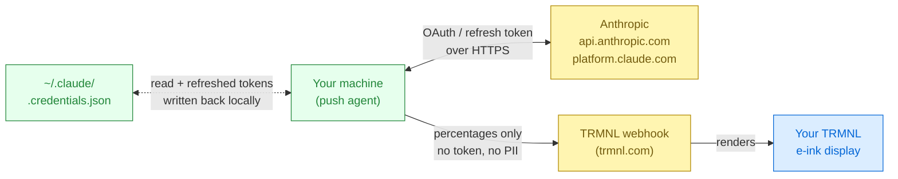

# Claude UNLMTD

TRMNL e-ink plugin that shows your Claude Code usage — the 5-hour session
window plus the 7-day all-models, Sonnet, and Opus buckets. Includes a
mood-reactive mascot that reads your utilization across the room.


> [!IMPORTANT]
> **Your Claude credentials never leave your device — except to Anthropic
> itself.** The push agent reads `~/.claude/.credentials.json` locally and
> talks directly to Anthropic (`api.anthropic.com` for usage,
> `platform.claude.com` for token refresh — the same endpoints Claude Code
> itself uses). When the access token expires the agent refreshes it via
> the stored refresh token and writes the new tokens back atomically,
> preserving every other field and the `0600` file mode. Only anonymised
> usage percentages (`session_percent`, `weekly_all_percent`, etc.) are
> POSTed to your TRMNL webhook — no OAuth token, no email, no user
> identifier.



## Setup

You'll need Python 3.8+ and Claude Code (`claude login` done at least once).

### 1. Add the plugin to your TRMNL

In your TRMNL dashboard → **Plugins** → **Marketplace**, search for
**Claude UNLMTD** and click **Install**. Then open the plugin's config
page and copy the **webhook URL** (looks like
`https://trmnl.com/api/custom_plugins/<id>`) — you'll paste it into the
installer in the next step.

### 2. Install the push agent

**macOS**

```bash
brew install --HEAD iosdev29/trmnl-claude-limits/trmnl-claude-limits
trmnl-claude-limits
```

**Linux (or macOS without brew)**

```bash
curl -fsSL https://raw.githubusercontent.com/iosdev29/trmnl-claude-limits/main/scripts/bootstrap.sh | bash
```

**Windows (PowerShell)**

```powershell
irm https://raw.githubusercontent.com/iosdev29/trmnl-claude-limits/main/scripts/bootstrap.ps1 | iex
```

Each opens the same interactive setup: paste your webhook URL, one test
push confirms it works, then a scheduler updates the display every 10
minutes. Your Claude OAuth token stays on your machine — TRMNL never
sees it.

## Uninstall

First stop the scheduler (same command everywhere):

```bash
trmnl-claude-limits --uninstall
```

Then remove the tool itself:

**macOS**

```bash
brew uninstall trmnl-claude-limits
```

**Linux**

```bash
rm -rf ~/.local/share/trmnl-claude-limits ~/.local/bin/trmnl-claude-limits
```

**Windows (PowerShell)**

```powershell
Remove-Item -Recurse -Force $env:LOCALAPPDATA\trmnl-claude-limits, $env:LOCALAPPDATA\Programs\trmnl-claude-limits
```

## Troubleshooting

- **`no Claude credentials found`** — run `claude login`.
- **`token rejected and refresh failed`** — refresh token was revoked (e.g.
  by logging out of Claude Code elsewhere); `claude login` again.
- **Numbers stuck on the device** — run `trmnl-claude-limits push --dry-run --verbose`
  to confirm the agent still works end-to-end.
