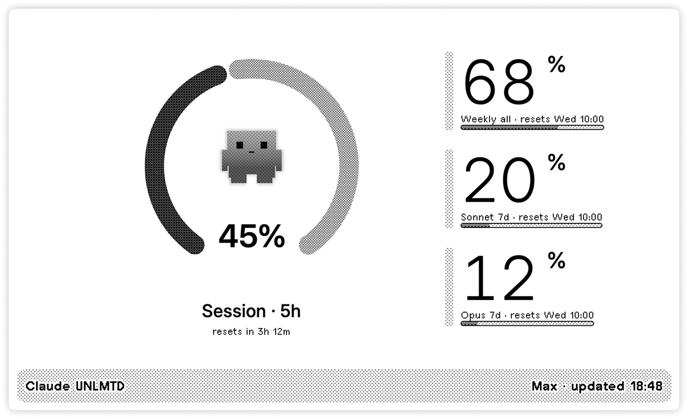
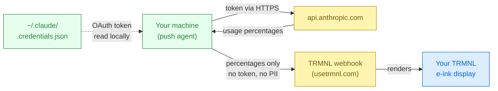

# Claude UNLMTD

TRMNL e-ink plugin that shows your Claude Code usage — the 5-hour session
window plus the 7-day all-models, Sonnet, and Opus buckets. Includes a
mood-reactive mascot that reads your utilization across the room.



> [!IMPORTANT]
> **Your Claude credentials never leave your device.**
> The push agent reads `~/.claude/.credentials.json` locally and calls
> `api.anthropic.com` directly. Only anonymised usage percentages
> (`session_percent`, `weekly_all_percent`, etc.) are POSTed to your TRMNL
> webhook — no OAuth token, no email, no user identifier.



## Setup

You'll need Python 3.8+ and Claude Code (`claude login` done at least once).

### 1. Create the TRMNL plugin

TRMNL dashboard → **Plugins** → **New plugin** → **Webhook**. Copy the
webhook URL (looks like `https://usetrmnl.com/api/custom_plugins/<id>`)
and paste each `.liquid` file from `views/` into the matching view editor
(Full, Half horizontal, Half vertical, Quadrant).

### 2. Install the push agent

**macOS**

```bash
brew install --HEAD iosdev29/trmnl-claude-limits/trmnl-claude-limits
trmnl-claude-limits
```

**Linux (or macOS without brew)**

```bash
curl -fsSL https://raw.githubusercontent.com/iosdev29/trmnl-claude-limits/main/scripts/bootstrap.sh | bash
```

**Windows (PowerShell)**

```powershell
irm https://raw.githubusercontent.com/iosdev29/trmnl-claude-limits/main/scripts/bootstrap.ps1 | iex
```

Each opens the same interactive setup: paste your webhook URL, one test
push confirms it works, then a scheduler updates the display every 10
minutes. Your Claude OAuth token stays on your machine — TRMNL never
sees it.

## Uninstall

```bash
trmnl-claude-limits --uninstall     # removes the scheduler
brew uninstall trmnl-claude-limits  # macOS: removes the tool too
```

## Troubleshooting

- **`no Claude credentials found`** — run `claude login`.
- **`token rejected (401)`** — token expired; `claude login` refreshes it.
- **Numbers stuck on the device** — run `trmnl-claude-limits push --dry-run --verbose`
  to confirm the agent still works end-to-end.
